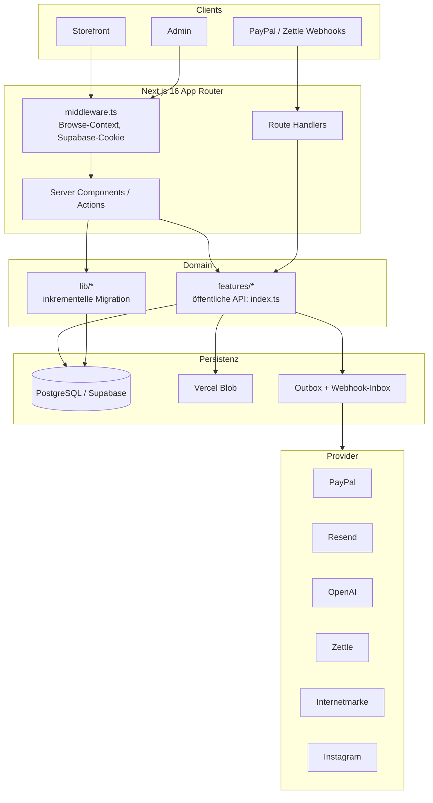

# Architektur-Skizze

Kompakter Überblick für jerry's (Boutique-Shop). Details: [ARCHITECTURE.md](./ARCHITECTURE.md), [ADR-Index](./adr/README.md), [features/README.md](../features/README.md).

**Form:** ein Next.js-**Modular Monolith** auf Vercel. Eine App, eine PostgreSQL-DB, Bounded Contexts in `features/`. Keine Microservices.



## Stack

| Schicht | Parameter |
| --- | --- |
| Runtime | **Next.js 16.3.0**, App Router, **React 19.2.4**, TypeScript 5 (`strict`) |
| Bundler | Dev: Webpack (`next dev --webpack`); optional Turbopack (`npm run dev:turbo`) |
| UI | Tailwind CSS 4, Lucide React, TipTap 3 (CMS), Embla Carousel |
| Auth | **Auth.js** (`next-auth` 5 beta), JWT, `subjectKind`: `admin` \| `customer`, Session **8 h** |
| Daten | **PostgreSQL** (Supabase), **Prisma 7.7** (`@prisma/adapter-pg` + `pg.Pool`) |
| Storage | Vercel Blob (öffentliche Medien, ADR-0008) |
| Validierung | Zod 4 |
| Tests | Vitest 4 (Unit/Integration), Playwright (E2E) |
| Deploy | Vercel; Preview / Staging / Production isoliert |
| Dev-Port | **3001** (`PORT` überschreibbar) |
| Server Actions | Body-Limit **15 MB** (Uploads) |
| Auth-Schutz | Admin im Node-Layout (`auth()`), **nicht** in der Edge-Middleware |

## Module (`features/`)

Öffentliche API nur über `features/<modul>/index.ts` (Catalog-Server: `features/catalog/server.ts`). Internes `domain` / `application` / `infrastructure` darf von außen nicht importiert werden — `npm run architecture:check`.

| Kontext | Verantwortung | Stand |
| --- | --- | --- |
| `catalog` | Produkte, Varianten, Kollektionen/Kategorien, Suche, Shopify-Import, AI-Produktbild | aktiv |
| `inventory` | Reservierungen, Bewegungen, Zettle-POS-Sync | aktiv |
| `customers` | Konto, Adressen, Auth-Tokens, Privacy, Gast-Claim | aktiv |
| `orders` | Zahlungs- und Fulfillment-Statusmaschinen (Order-Lifecycle noch in `lib/orders`) | teil-migriert |
| `workshops` | Sessions, Holds, Bookings, Self-Cancel | aktiv |
| `fulfillment` | Shipments, Internetmarke-Labels | aktiv |
| `integrations` | Outbox, Webhook-Inbox, Blob, AI-Port, Embeddings | aktiv |
| `payments` | geplant — Logik heute in `lib/payments` + `lib/orders` | nicht extrahiert |
| `cart`, `checkout`, `auth`, `admin`, `email` | Platzhalter; Logik in `lib/` und `app/` | inkrementell |

## App-Oberflächen

```text
app/
  (storefront)/     /  /produkte  /kategorien  /kollektionen
                    /warenkorb  /checkout  /termine  /konto  /[...slug]
  admin/            /login  Dashboard: Produkte, Bestellungen, Bestand,
                    Termine, Inhalte, Versand, Einstellungen, …
  api/              Auth.js, PayPal, Webhooks, Workshop-Checkout,
                    Admin-Suche/Invoice, commerce-maintenance
```

- UI-nahe Mutationen: **Server Actions** (Zod).
- Provider-Callbacks / Webhooks: **Route Handlers**; Inbox persistieren, dann ack.
- Kein Prisma direkt aus React-UI.

## Laufzeit-Parameter

| Thema | Wert |
| --- | --- |
| DB Runtime | `DATABASE_URL` = Supabase **Transaction Pooler `:6543`** (`?pgbouncer=true`) |
| DB Migrate/Seed | `DIRECT_DATABASE_URL` oder `PRISMA_MIGRATE_DATABASE_URL` (`:5432` direkt) |
| App-Pool | Vercel `pg.Pool max: 1` (Override `PG_POOL_MAX`); lokal 3 |
| Cron | täglich **05:00 UTC** → `/api/internal/commerce-maintenance` |
| Stock-Hold | **2 h** (`STOCK_RESERVATION_TTL_MS`) |
| Dateisystem | ephemer — keine dauerhaften Writes auf Vercel |
| Branding | `ShopSettings` Singleton `id = default` (ohne Redeploy) |

### Pflicht-Env (Betrieb)

`DATABASE_URL`, `AUTH_SECRET`, `NEXT_PUBLIC_SITE_URL` (Prod). Typisch dazu: `RESEND_API_KEY` + `MAIL_FROM_*`, `BLOB_READ_WRITE_TOKEN`, `COMMERCE_MAINTENANCE_SECRET` / `CRON_SECRET`. Optional: PayPal, OpenAI, Instagram, Zettle, Internetmarke — siehe `.env.example`.

## Statusmaschinen (getrennt)

| Aggregat | Status |
| --- | --- |
| Order | `draft` → `pending_payment` → `paid` → `processing` → `shipped` → `completed`; daneben `cancelled`, `refunded`, `retoure`, `bestaetigt` |
| Payment | `pending` → `processing` → `succeeded` → `partially_refunded` → `refunded`; `failed`, `canceled` |
| Fulfillment | `unfulfilled` → `preparing` → `shipped` → `delivered` / `returned` |
| Shipment | `draft` → `labeled` → `shipped` → `delivered`; `voided`, `returned` |
| Booking | `held` → `confirmed` → `attended` / `no_show` / `cancelled` / `refunded` / `expired` |
| Session | `draft` → `published` → `completed` / `cancelled` |

Browser-Redirects sind **keine** Zahlungsbestätigung. Webhooks + Reconciliation sind maßgeblich.

## Qualität

```bash
npm run validate   # architecture:check + lint + typecheck + unit + integration
```

CI: GitHub Actions. UI: Design-Tokens in `app/globals.css`, Regeln in [DESIGN_SYSTEM.md](./DESIGN_SYSTEM.md) (Primärgrün, Lucide, WCAG 2.2 AA).
