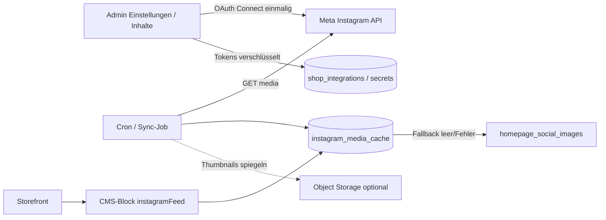

# Konzept: Dynamischer Instagram-Feed im CMS (Machbarkeit)

Status: **Konzept / Machbarkeit** (kein Implementierungs-ADR)  
Zielbild: Einmalig Instagram anbinden, Feed-Bilder dynamisch im Storefront/CMS nutzen — analog zu gängigen Shopify-Instagram-Apps.

## 1. Ausgangslage heute

| Baustein | Ist-Zustand |
|----------|-------------|
| CMS-Block `socialReviews` | Steuert nur Text/Sichtbarkeit; lädt **keine** Instagram-API |
| Galerie | Kuratierte Zeilen in `homepage_social_images` (Admin: **Inhalte → Marketing**) |
| Upload | Lokal unter `public/media/homepage-social/` (ephemeral; ADR-0008 sieht Blob-Migration vor) |
| ShopSettings | Nur Profil-URL `instagramUrl` |
| Meta/Graph | **Nicht** vorhanden (keine Tokens, kein Sync, kein Embed) |

Shopify-ähnliche Erwartung: OAuth einmal verbinden → Raster/Carousel zeigt aktuelle Posts → Widget auf Seiten platzieren.

## 2. API-Realität (Stand 2025/2026)

- **Instagram Basic Display API** ist seit Dez. 2024 **tot** — kein Feed für private/persönliche Accounts mehr.
- Offizieller Weg nur für **Professional Accounts** (Business oder Creator):
  - **Empfohlen für jerry's:** *Instagram API with Instagram Login* (`graph.instagram.com`, Scope z. B. `instagram_business_basic`) — Creator/Business, oft **ohne** Facebook-Page.
  - Alternative: *Instagram Graph API* über Facebook Login + Page (`graph.facebook.com`), wenn der Account ohnehin an eine Page gebunden ist.
- Produktion braucht typischerweise: Meta Developer App, **App Review**, ggf. Business Verification, Langzeit-Tokens + Refresh.
- Media-CDN-URLs von Meta sind **nicht dauerhaft** — Sync/Cache nötig, nicht nur „URL speichern und vergessen“.

**Voraussetzung beim Kundenaccount:** `@jerrys.design` (o. Ä.) muss Professional (Business/Creator) sein. Rein persönliche Accounts sind API-seitig nicht anbindbar.

## 3. Machbarkeitsurteil

| Frage | Antwort |
|-------|---------|
| Technisch machbar? | **Ja**, mit Meta Professional + App Review |
| „Wie Shopify-Plugin“ (einmal verbinden, CMS einbinden)? | **Ja** als Produktziel |
| Live Graph-Call bei jedem Storefront-Request? | **Nein** (Rate Limits, Latenz, Token-Ausfall, SSR/CDN) |
| Empfehlung | **Connect einmal → periodischer Sync in eigene Cache-Tabelle → CMS-Block liest Cache** |

Aufwand grob: eigenes kleines Epic (Auth/Connect, Token-Vault, Sync-Job, neuer/erweiterter CMS-Block, Admin-UX, Fallback auf kuratiert). Nicht ein Nachmittag.

## 4. Zielarchitektur (empfohlen)

### 4.1 Einmalige Anbindung

- Admin-UI: **„Instagram verbinden“** (OAuth Redirect → Callback).
- Speichern: `ig_user_id`, Account-Handle, **encrypted** access/refresh token, `token_expires_at`, `connected_at`, Sync-Status.
- Trennung von `ShopSettings.instagramUrl` (öffentlicher Profil-Link) und der Integration (API-Credentials).
- Pattern analog bestehender Secrets/Integrationen; Outbox optional für Sync-Events.

### 4.2 Sync (nicht Live-pro-Request)

- Geplant z. B. alle **15–60 Min** via bestehendem Cron-Muster (`CRON_SECRET` / Maintenance-Route) oder dedizierter Route.
- Abruf: letzte *N* Medien (z. B. 12–24), Typen IMAGE/CAROUSEL (VIDEO optional später).
- Persistenz je Post: `media_id`, `permalink`, `caption` (gekürzt), `media_type`, `thumbnail_url` / gespiegelte Blob-URL, `timestamp`, `synced_at`.
- **Bild-Spiegelung in Blob** empfohlen (ADR-0008): Meta-URLs laufen ab; Storefront hängt nicht am Meta-CDN.
- Fehler: letztes erfolgreiches Cache behalten; Admin zeigt „Sync fehlgeschlagen / Token abgelaufen“.

### 4.3 CMS-Einbindung

Neuer Block-Typ **`instagramFeed`** (oder `socialReviews` um Quelle erweitern):

| Feld | Bedeutung |
|------|-----------|
| `source` | `liveCache` \| `curated` (Default/Fallback) |
| `limit` | 1–24 |
| `layout` | `carousel` \| `grid` |
| `title` / `intro` | Text |
| `ctaLabel` / Profil | optional, Fallback `ShopSettings.instagramUrl` |

Editor: Block platzieren wie andere CMS-Blöcke; **keine** erneute OAuth pro Seite. Connect global einmal.

Live-Vorschau im Editor: Cache-Stand (oder Hinweis „noch nicht verbunden / Sync ausstehend“).

### 4.4 Storefront-Verhalten

- Server Component liest **nur** Cache (+ kuratierten Fallback).
- Kein Client-seitiger Meta-Token.
- Leerer Cache / Disconnect: Fallback auf kuratierte Marketing-Bilder **oder** Sektion ausblenden (konfigurierbar).
- Consent: reine First-Party-Darstellung eigener, gecachter Bilder → typisch **kein** Marketing-Cookie nötig; Permalink-Klicks gehen zu Instagram. (Rechtlich final mit Datenschutz abstimmen.)

## 5. Alternativen (bewusst nachrangig)

| Option | Pro | Contra |
|--------|-----|--------|
| **A. Empfohlen: Meta + Cache + CMS-Block** | Shopify-ähnlich, einmal Connect, kontrollierbar | App Review, Token-Pflege, Sync-Komplexität |
| B. Drittanbieter (Embedsocial, SnapWidget, …) | Schnell UI | Vendor, DSGVO/Auftragsverarbeitung, Kosten, weniger „owned“ |
| C. Offizielle Embed-oEmbed pro Post | Einfach für Einzelposts | Kein automatischer Feed; manuell/kuratiert |
| D. Scraping / inoffizielle APIs | — | **Verboten / fragil**, nicht akzeptabel |
| E. Status quo kuratiert | Stabil, schon live | Nicht „dynamisch“ |

## 6. Abgrenzung zum Ist-Marketing

- Kuratierte `homepage_social_images` bleiben als **Fallback** und für bewusst ausgewählte Motive sinnvoll.
- Später optional: Sync kann Cache befüllen; Marketing-UI zeigt „Live-Feed“ vs. „Manuell“.
- Homepage-Social-Uploads langfristig ohnehin nach Blob migrieren (ADR-0008) — Feed-Spiegelung kann denselben Storage nutzen.

## 7. Risiken & offene Punkte

1. **App Review / Verifikation** — Zeit und Meta-Freigabe; ohne Advanced Access nur Test-User.
2. **Token-Lifecycle** — Refresh-Job; UX bei Disconnect.
3. **URL-Ablauf** — ohne Blob-Spiegelung brechen Thumbnails.
4. **Rate Limits / Ausfälle** — Cache + Fallback Pflicht.
5. **ToS / Darstellung** — Instagram Branding Guidelines (z. B. klarer Bezug zum Profil, keine irreführende „native“ UI).
6. **Account-Typ** — Professional bestätigt?
7. **Welche Meta-Login-Variante?** — Instagram Login vs. Facebook+Page (Entscheidung vor Slice 1).

## 8. Vorschlag Epic-Schnitte (nach Freigabe)

1. **Slice 0 – Voraussetzungen:** Meta App anlegen, Account Professional, Sandbox/Test-User, Env-Secrets-Skizze.
2. **Slice 1 – Connect:** OAuth, verschlüsselte Token-Persistenz, Admin „verbunden / trennen“.
3. **Slice 2 – Sync:** Cron, Cache-Tabelle, optional Blob-Spiegelung, Sync-Status.
4. **Slice 3 – CMS-Block:** `instagramFeed` Registry + Renderer + Editor; Fallback kuratiert.
5. **Slice 4 – Polish:** App Review Prod, Monitoring, Docs (`SECURITY_SURFACE`, Ops), kuratiertes Marketing entkoppeln/hinweisen.

## 9. Entscheidung nötig vom Product Owner

1. Professional-Account + Bereitschaft Meta App Review?
2. Eigenbau (Empfehlung) vs. Drittanbieter-Widget?
3. Fallback-Verhalten: kuratierte Bilder behalten oder Sektion verstecken?
4. Videos/Reels in V1 oder nur Standbilder/Carousel-Cover?

## 10. Kurzfazit

**Machbar und zum Shopify-Muster kompatibel**, wenn der Account Professional ist und Meta App Review eingeplant wird. Architektur: **einmal OAuth → Sync in eigenen Cache → CMS-Block**. Live-API auf dem Storefront-Request-Pfad vermeiden. Der heutige kuratierte Marketing-Flow bleibt sinnvoller Fallback bis Connect/Sync produktiv und stabil sind.
